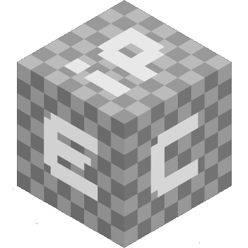
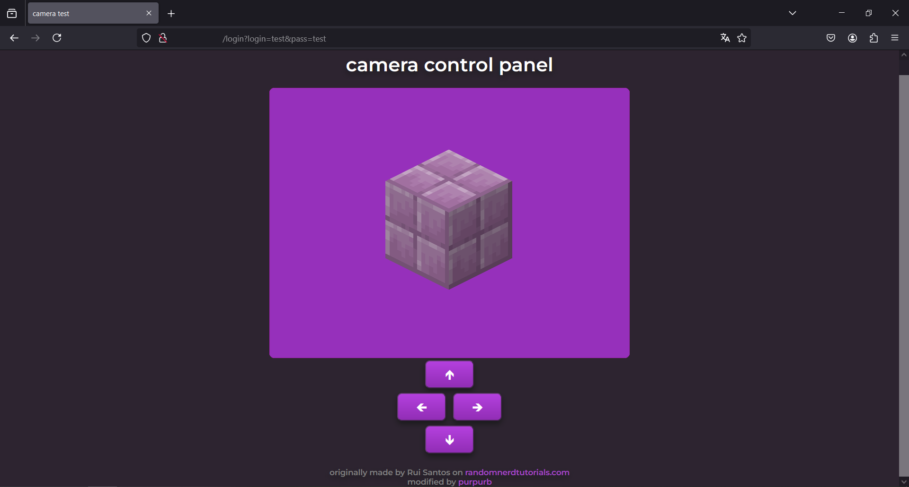
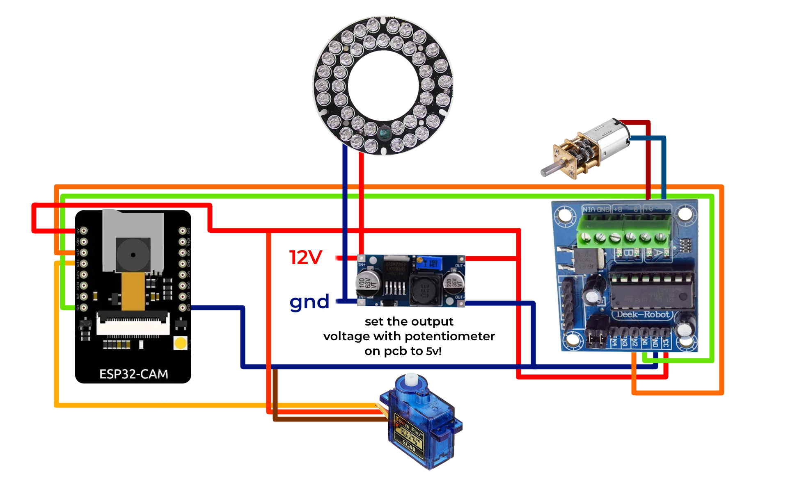

# espipcam 
 ## this project is in development , so i dont recommend trying to recreate it now ⚠
   
 ## ESP32-CAM Dev Board based IP camera
   Simple IP camera , with 2 axis movement and night vision (optional) , made on ESP32-CAM Dev Board.
   
 ## parts you need
  - ESP32-CAM Dev Board
  - OV2640 (or other ESP32 compatible camera modules) without IR filter
  - IR LED ring PCB (optional if you dont want night vision)
  - Servo motor SG90 (or other models compatible with ESP32Servo.h lib)
  - L293D H-Bridge motor driver (or other H-Bridge modules)
  - HW-677 module (optional if you arent going to use IR LED ring)
  - 3D printed case parts
  - that's all!
## wiring scheme
scheme with IR LED PCB
  
## setup routine
 ### 1st step: configure Arduino IDE sketch
   - **(optional)** if you want to change pinout , you can in **main.ino** from line 130 to line 132 set your pin config for Servo motor and H-Bridge logic pins.
   - in **credentials.h** configure your WiFI network credentials and __camera control panel__ password and username.
   - in **main.ino** from line 25 to line 29 you can select your camera module model , by uncommenting line with name of your module. 
 ### 2nd step: compile and flash sketch into ESP32!
   - if you dont know how to do it , read Espressif docs on ESP32 boards.
## 3D printing camera case parts
  in the [/cadsrc](/cadsrc) folder is FreeCad project.
  and in the [/export](/export) folder are .3mf files for 3D printing.
 
### You can DM me in my discord (@purpurb.) , if i typed the word wrong way or something like that.   
