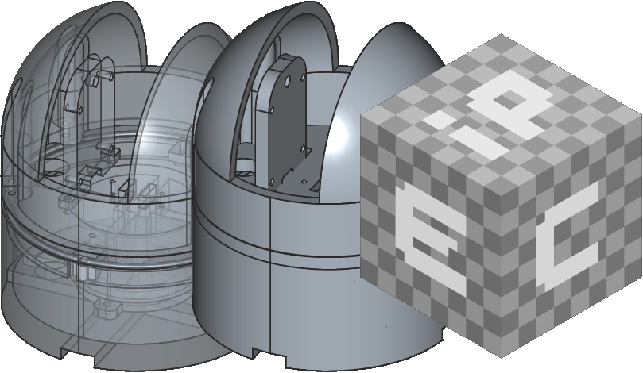

# espipcam
 ## this project is in development , so i dont recommend trying to recreate it now ⚠
   
 ## ESP32-CAM Dev Board based IP camera
   Simple IP camera , with 2 axis movement and night vision , made on ESP32-CAM Dev Board
    
